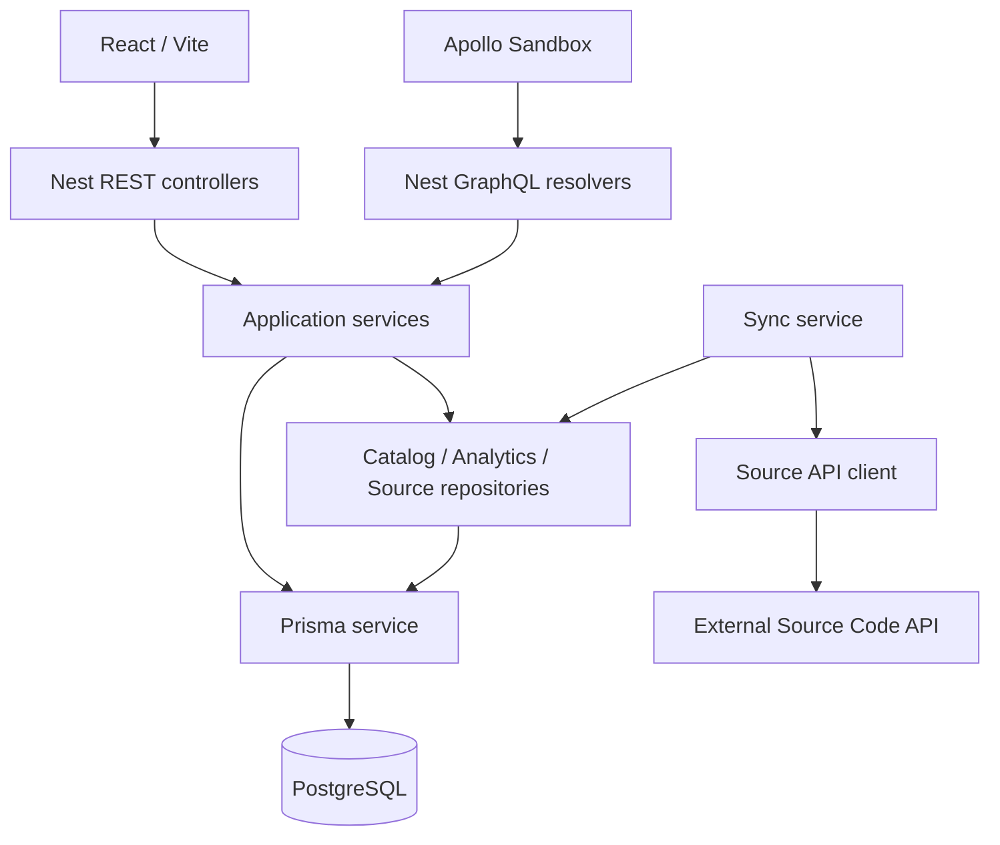

# Архитектура

Бэкенд — модульный монолит NestJS. Каждый функциональный модуль владеет своими операциями; внешний API, хранение и транспорт разделены. Для GraphQL используется schema-first подход: `src/schema.graphql` описывает публичный контракт, из него генерируются TypeScript-типы. Внутренние Prisma-модели используют camelCase, существующие таблицы и столбцы сопоставлены через `@map` и `@@map`.

## Модули

| Модуль | Ответственность |
| --- | --- |
| `auth` | Argon2, JWT, сессии PostgreSQL, атомарная ротация, CSRF, cookie, guards и лимиты |
| `users` | Профиль, языки, роли, блокировки и статистика регистраций |
| `catalog` | Проекты, репозитории, ветки, коммиты и курсорная пагинация |
| `analytics` | Агрегатные запросы, KPI, серии, статистики и рекомендации |
| `integration` | Внешний HTTP-клиент, проверка входящих данных, синхронизация и запись агрегатов |
| `infrastructure/database` | Prisma Client, управление соединением и начальные роли |
| `config` / `common` | Проверка окружения, входных параметров, курсоров и ошибок HTTP |

Контроллеры и резолверы содержат только транспортные операции. Авторизация находится в общих guards. Бизнес-методы вызываются одинаково через REST и GraphQL. Математические расчёты аналитики и парсер diff — отдельные функции без HTTP и базы; их можно проверять независимо.

Для сложного чтения и атомарного импорта используются отдельные репозитории. Небольшие операции пользователей и сессий обращаются к типизированному Prisma Client непосредственно, чтобы не создавать интерфейсы, повторяющие CRUD-методы ORM.

## Контракты и совместимость

Сохранены все 24 действующих маршрута исходного FastAPI-приложения. Дополнительно доступны административные операции, ранее существовавшие в исходниках, и ручной запуск импорта. GraphQL-поля и REST-ответы сохраняют названия полей исходного контракта; GraphQL-операции используют camelCase.

| REST | GraphQL |
| --- | --- |
| `POST /api/v1/auth/register`, `/login`, `/refresh`, `/logout` | `register`, `login`, `refresh`, `logout` |
| `GET/PATCH /api/v1/users/me/` | `me`, `updateProfile` |
| `GET /api/v1/languages/` | `languages` |
| `GET /api/v1/entities/projects/`, `/:id/` | `projects`, `project` |
| `GET /api/v1/entities/projects/:id/repos` | `repositories` |
| `GET /api/v1/entities/repos/:id/branches`, `/commits` | `branches`, `repositoryCommits` |
| `GET /api/v1/metrics/summary` | `metricsSummary` |
| `GET /api/v1/metrics/timeline/summary` | `timelineSummary` |
| `GET /api/v1/developers/summary` | `developersSummary` |
| `GET /api/v1/developers/:id/summary`, `/commits` | `developerSummary`, `developerCommits` |
| `GET /api/v1/insights` | `insights` |

Профиль и каталог требуют Bearer access JWT. Аналитические маршруты сохраняют исходную публичную доступность. Административные операции требуют `users.read`, `users.ban` или `users.manage_roles`; первый зарегистрированный пользователь автоматически администратором не становится.

Курсор построен из последней возвращённой записи и стабильного вторичного ключа. Так устранён пропуск записи, присутствовавший в исходной реализации. Неверные даты, идентификаторы и курсоры отклоняются до обращения к базе. В REST ошибки имеют `detail`, в GraphQL — стандартные `errors` с кодами `UNAUTHENTICATED`, `FORBIDDEN`, `BAD_USER_INPUT`, `NOT_FOUND`, `CONFLICT` и `TOO_MANY_REQUESTS`.

## Метрики

Дни и часы вычисляются в UTC, обе границы диапазона дат включены. Рабочие часы — 09:00–18:59. Короткое сообщение содержит менее 50 Unicode-символов. Размер коммита — добавленные плюс удалённые строки.

Сохранены бакеты `0-10`, `11-50`, `51-100`, `100+`, их центры `5`, `30.5`, `75.5`, `125` и исходное приближение среднего/медианы. Чтение агрегатов выполняется в транзакции `REPEATABLE READ`, поэтому части одного ответа используют согласованный снимок базы.

Ограничение исходной модели сохранено: агрегаты по часам, размерам и файлам относятся к репозиториям и не имеют измерения автора. `author_ids` ограничивает авторские KPI, дневную серию и ленту коммитов; репозиторные распределения следуют прежнему поведению. Изменение этой семантики требует отдельной миграции и согласования контрактов.

## Импорт

`SourceApiClient` отвечает за HTTP, авторизацию, таймауты, одно повторение после 401 и проверку ответов Zod. `SyncService` управляет расписанием, курсорами и статусом. `SourceRepository` записывает проекты, ветки, авторов и коммиты. `aggregate-writer` обновляет агрегаты в той же транзакции, что и коммит.

Отдельное PostgreSQL-соединение удерживает advisory lock на весь импорт, предотвращая одновременную синхронизацию несколькими экземплярами приложения. HTTP-запросы выполняются вне транзакций записи. Для каждого коммита запись, файлы и его вклад в агрегаты обновляются атомарно. Повторный импорт сначала вычитает прежний вклад, затем добавляет актуальный; ошибки diff сохраняют существующую статистику. Удаляются исчезнувшие ветки, проверяется повторение курсоров, а запрос коммитов перекрывает предыдущую синхронизацию на 60 секунд.

## Миграция и эксплуатация

Первый SQL baseline соответствует действующей PostgreSQL-схеме, включая индексы `pg_trgm`, enum размеров, внешние ключи и check constraints. На пустой базе он применяется обычной миграцией. Существующая база принимается только при проверенной Alembic-ревизии `41ffcd3b898b`: baseline отмечается выполненным, затем добавляются таблицы сессий и лимитов. Старые таблицы сохраняются.

Пароли Argon2 остаются совместимыми. RSA JWT можно продолжить подписывать существующей парой ключей. Сессии из Redis после перехода не принимаются: требуется новый вход, чтобы состояние отзыва токенов не потерялось при отказе от Redis. Новые сессии и лимиты общие для всех экземпляров приложения; истёкшие записи очищаются по расписанию.

При недоступном внешнем API приложение остаётся доступным, статус синхронизации становится `failed`, сохранённые данные не стираются. `/health` проверяет соединение с PostgreSQL. Compose запускает nginx после готовности бэкенда; контейнер бэкенда работает без root и получает секреты через окружение.
